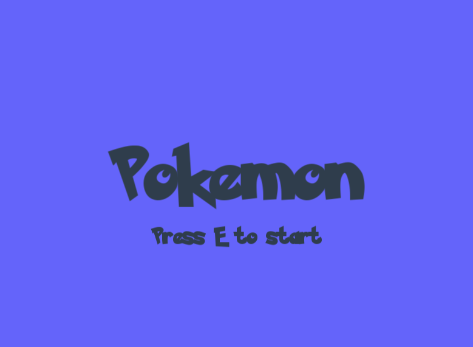
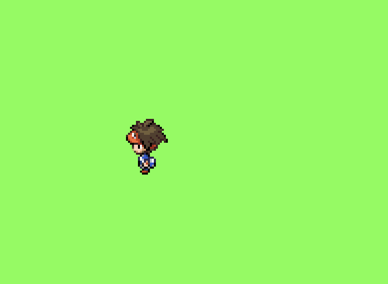
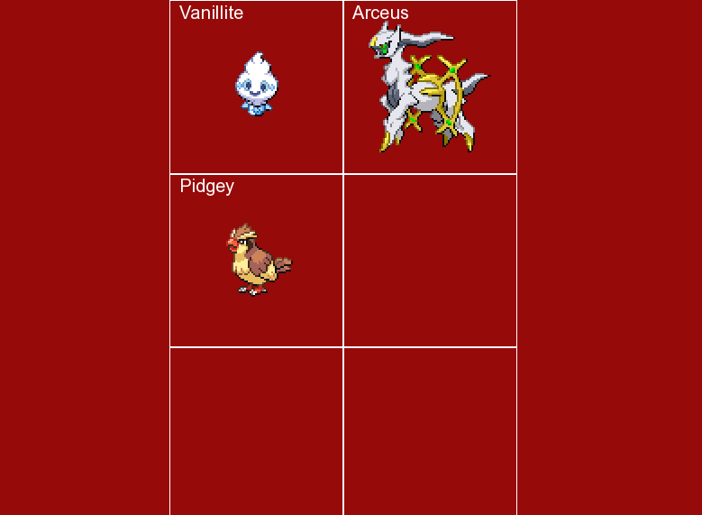
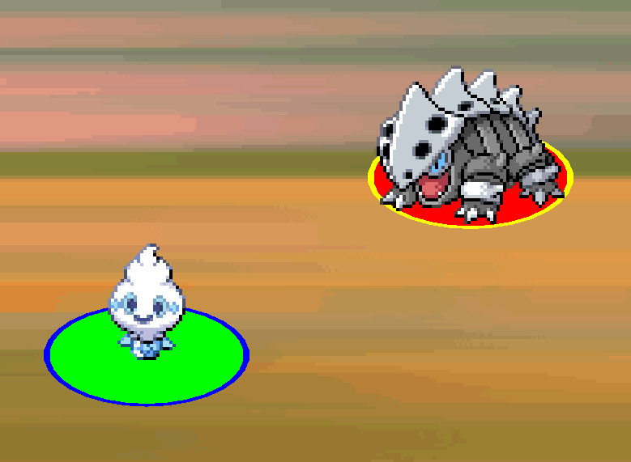
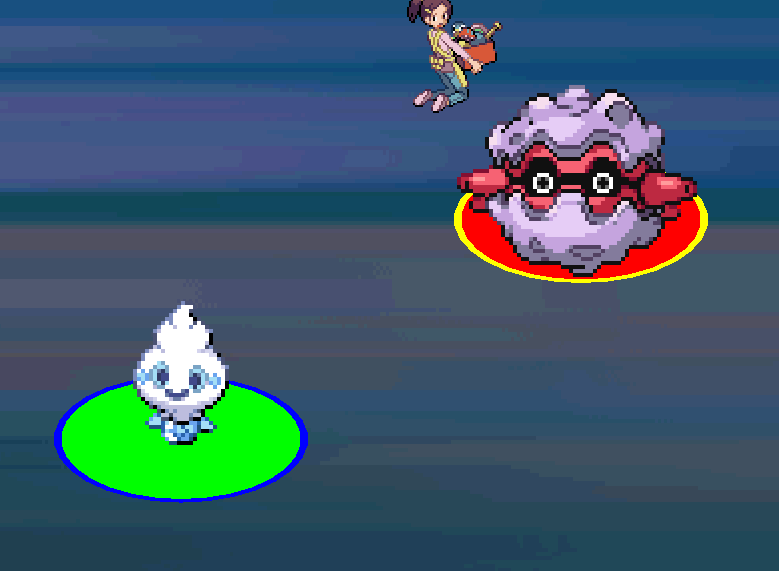
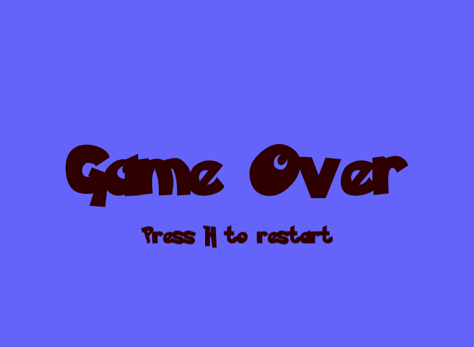

# TP_cpp (Pokemon Project)


## Classes

*   **Pokemon Class**: Represents individual Pokemon with attributes like ID, name, HP, attack, defense, and speed.
*   **Pokemon Collections**: Classes like `PokemonVector`, `PokemonParty`, and `PokemonAttack` to manage groups of Pokémon.
*   **Pokedex**: A singleton class to load and provide access to Pokémon data from a CSV file.
*   **Game Engine**: Game state management system with different states (Menu, Exploration, Party, etc.).
*   **Trainer & Player**: Character classes for trainers and the player character with sprite rendering.


## Project Structure

```
TP_cpp/
├── CMakeLists.txt
├── main.cpp
├── sources/           # Game assets (CSV, sprites, fonts)
├── utils/
│   ├── inc/          # Header files organized by module
│   │   ├── Pokemon/  # Pokemon-related classes
│   │   ├── GameStates/ # Game state management
|   |   └── Utils/    # all-purpose functions
│   └── src/          # Implementation files (mirrors inc/)
└── tests/            # Unit tests
```

### Key Modules
- **Pokemon System**: Core Pokemon classes, Pokedex, collections
- **Game Engine**: State management, rendering, input handling  
- **Character System**: Player, Trainer, movement and sprites
- **Resource Management**: Texture manager, asset loading


## Building the Project

### Prerequisites

*   A C++20 compatible compiler (like GCC or Clang)
*   CMake (version 3.28 or higher)
*   SFML library for graphics and window management

### Build Steps

1.  **Clone the repository:**
    ```bash
    git clone https://github.com/Mael-Archenault/TP_cpp.git
    cd TP_cpp
    ```

2.  **Create a build directory:**
    ```bash
    mkdir build
    cd build
    ```

3.  **Configure with CMake:**
    ```bash
    cmake ..
    ```

4.  **Compile the project:**
    ```bash
    make
    ```

    This will create the main executable `TP_cpp` and the test executables in the `build` directory.

## Running the Application

```bash
./TP_cpp
```

The application features a Pokemon game with multiple states including menu, exploration, and party management.

## Running Tests

You can run the tests using CTest after building the project.

```bash
cd build
ctest
```

Alternatively, you can run individual test executables directly:

```bash
./test_pokedex
./test_pokemon
# etc.
```

## Game States Description

### Home State
- first state when launching the game
- the only thing you can do is **press E** to start the game



### Exploration State

- you can move your player on the map
- **press on B** to switch to the **bag view**
- **go on the far left** to enter a **fight with a wild pokemon**
- **go on the far right** to enter a **fight with a champion**

<div style="display: flex; gap: 10px;">
  
  
</div>

### Bag view
- shows all the pokemons you have in your bag (maximum: 6)
- the first is the one chosen for fights
- **press Esc** to return to the Exploration State



### Fight with a wild pokemon

-**press on K** to knock out the wild pokemon, the fight will end and you will return to the exploration state
- **press on R** to run away from the fight, you will return to the exploration state
- **press on C** to catpure the pokemon, once this is done, you will return to the exploration state with the wild pokemon in your **bag**




### Fight with a champion

- **press on K** to knock out the opponent's pokemon, the fight will end and you will return to the exploration state
- -**press on G** and you will lose the fight. This will trigger the Game Over State.




### Game Over State
- **press on H** to return to the Home State


